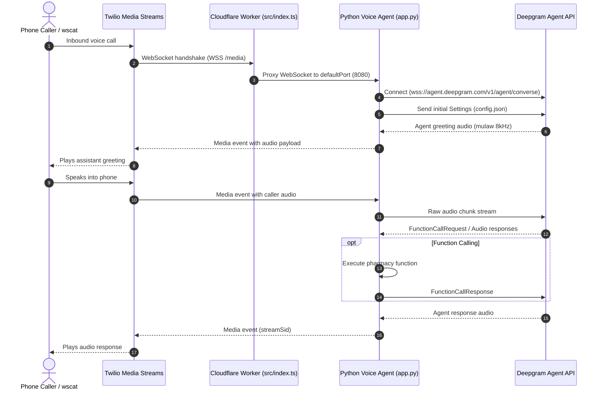

# Deepgram Voice Agent

A real-time, bidirectional AI voice agent bridging **Twilio Media Streams** and **Deepgram Voice Agent API** (`wss://agent.deepgram.com/v1/agent/converse`). The application is containerized and deployable both locally (via `uv` and Docker Compose) and to Cloudflare Containers (via Worker Durable Objects and Wrangler).

---

## Architecture Overview



---

## Prerequisites

| Tool | Version / Requirement | Purpose | Installation Link |
|---|---|---|---|
| **Python** | 3.13+ | Application runtime | [python.org](https://www.python.org/) |
| **uv** | Latest | Fast Python package manager | [astral.sh/uv](https://docs.astral.sh/uv/) |
| **Node.js & npm** | Node 18+ / npm 9+ | Cloudflare Wrangler tooling | [nodejs.org](https://nodejs.org/) |
| **Docker & Docker Compose** | Docker Desktop 4.x+ | Local container runtime & Cloudflare image builder | [docker.com](https://www.docker.com/) |
| **Deepgram API Key** | Voice Agent API access | AI STT / LLM / TTS pipeline | [console.deepgram.com](https://console.deepgram.com/) |
| **Twilio Account** | Programmable Voice Number | Telephony integration | [twilio.com](https://www.twilio.com/) |
| **Cloudflare Account** | Workers Paid (Containers enabled) | Serverless container deployment | [dash.cloudflare.com](https://dash.cloudflare.com/) |

---

## Environment Configuration

Create a `.env` file in the project root:

```ini
# Required for Deepgram WebSocket authentication
DEEPGRAM_API_KEY=your_deepgram_api_key_here

# Optional local port override (default is 5000 for direct Python, 8080 for Docker)
PORT=8080
```

> **Security Note:** `.env` is ignored in git and Docker builds (`.dockerignore`). Secrets for Cloudflare deployments are managed through Wrangler secrets.

---

## Option 1: Local Development (Python & uv)

Run the Python application directly on your host machine without Docker.

### 1. Install uv
```bash
# macOS / Linux
curl -LsSf https://astral.sh/uv/install.sh | sh

# Windows (PowerShell)
powershell -ExecutionPolicy ByPass -c "irm https://astral.sh/uv/install.ps1 | iex"
```

### 2. Install Project Dependencies
```bash
uv sync
```
This resolves dependencies from `pyproject.toml` and creates a virtual environment in `.venv`.

### 3. Run the Development Server
```bash
PORT=8080 uv run python app.py
```
The server will listen at `http://0.0.0.0:8080` and expose the WebSocket at `ws://localhost:8080/media`.

---

## Option 2: Local Docker Development (Docker Compose & Makefile)

Run the containerized application locally matching the Cloudflare production environment.

### Available Make Targets
```bash
make help
```

### Common Commands
```bash
# 1. Build the Docker image
make build

# 2. Start the container in the background
make up

# 3. Verify server health
make health

# 4. Stream real-time container logs
make logs

# 5. Restart container
make restart

# 6. Stop and remove container
make down

# 7. Clean all local images, volumes, and containers
make clean
```

---

## Option 3: Cloudflare Containers Deployment (npm & Wrangler)

Deploy the container as a Cloudflare Durable Object Worker.

### 1. Install Node Dependencies
```bash
npm install
```
This installs `wrangler` and `@cloudflare/containers` specified in `package.json`.

### 2. Configure Cloudflare Secrets
Set your `DEEPGRAM_API_KEY` in Cloudflare Secrets:
```bash
make secret
# Or manually:
npx wrangler secret put DEEPGRAM_API_KEY
```
When prompted, paste your key and press Enter.

### 3. Deploy Worker and Container
```bash
make deploy
# Or manually:
npx wrangler deploy
```

Wrangler will:
1. Build the Docker image locally.
2. Push the image to the Cloudflare Container Registry (`registry.cloudflare.com`).
3. Deploy the Worker (`src/index.ts`) and provision the Durable Object instance.
4. Output your public URL: `https://voice-agent.<subdomain>.workers.dev`.

### 4. Teardown / Undeploy
To completely remove the container application and the Worker:
```bash
make undeploy
```

---

## Twilio Media Streams Configuration

### 1. Configure TwiML Bin / Webhook
In the [Twilio Console](https://console.twilio.com/), create a TwiML Bin or set your phone number's voice webhook to return:

```xml
<?xml version="1.0" encoding="UTF-8"?>
<Response>
    <Connect>
        <Stream url="wss://voice-agent.<YOUR_SUBDOMAIN>.workers.dev/media" />
    </Connect>
</Response>
```

### Critical Rules for Twilio
- **Use `<Connect>` (Bidirectional):** The `<Connect><Stream>` verb streams audio in both directions. **Do not use `<Start><Stream>`**—`<Start>` is unidirectional (audio fork) and discards any audio returned to Twilio, causing total silence.
- **Protocol:** Must be `wss://` for Cloudflare deployments (or `ws://` for local tunnels).
- **Route:** Path must match `/media`.

---

## Testing and Debugging

### 1. Test WebSocket with `wscat`

Install `wscat`:
```bash
npm install -g wscat
```

#### Test Local:
```bash
wscat -c ws://localhost:8080/media
```

#### Test Cloudflare Deployment:
```bash
wscat -c wss://voice-agent.<YOUR_SUBDOMAIN>.workers.dev/media
```

#### Send Twilio Start Event:
Once connected, paste the following JSON message:
```json
{"event":"start","start":{"streamSid":"test_stream_12345"}}
```
**Expected behavior:**
The agent connects to Deepgram, applies `config.json`, and streams back `media` events containing base64 audio frames with the spoken greeting.

### 2. Live Cloudflare Logs

- **Worker Proxy Logs:**
  ```bash
  npx wrangler tail
  ```
- **Container stdout/stderr Logs:**
  ```bash
  npx wrangler containers logs
  ```

---

## Local vs. Cloudflare Deployment Comparison

| Aspect | Local Development (uv / Docker) | Cloudflare Containers Deployment |
|---|---|---|
| **Runtime** | Local Python 3.13 / Docker engine | Cloudflare Container on Durable Objects |
| **HTTP / WS Routing** | Direct to Flask on `0.0.0.0:8080` | Client -> Worker (`src/index.ts`) -> Container |
| **WebSocket Port** | `ws://localhost:8080/media` | `wss://voice-agent.<subdomain>.workers.dev/media` |
| **Secrets / Env** | `.env` file via `python-dotenv` / Compose | Cloudflare Worker Secrets (`DEEPGRAM_API_KEY`) |
| **Lifecycle** | Manual start / stop (`make up`, `make down`) | Auto-wakes on request; sleeps after 10m inactivity |
| **Concurrency** | Gunicorn (1 worker, 50 threads) | Gunicorn (1 worker, 50 threads) per DO instance |
| **Log Inspection** | `make logs` / `docker compose logs` | `npx wrangler tail` / `npx wrangler containers logs` |

---

## File Structure

```text
├── Dockerfile              # Container image definition with Python 3.13 & uv
├── Makefile                # Automation for Docker, Secrets, and Wrangler
├── README.md               # Project documentation
├── app.py                  # Flask WebSocket server (Twilio <-> Deepgram bridge)
├── config.json             # Deepgram Voice Agent settings, STT/LLM/TTS config
├── docker-compose.yml      # Local container orchestration
├── package.json            # Node dependencies for Wrangler & Containers
├── pharmacy_functions.py   # Tool/function definitions for the AI agent
├── pyproject.toml          # Python dependencies managed by uv
├── src/
│   └── index.ts            # Cloudflare Worker entrypoint & Container binding
├── uv.lock                 # Pinned Python dependencies
└── wrangler.jsonc          # Cloudflare Worker & Container configuration
```
